# JsAssignmentDay1

<h3> Part 1: Basics & Variables Assignment Outputs </h3>

<h5> P1 - 1st </h5>

[Easy] Declare a variable named favoriteFood using const and assign it a string value of your favorite food. Print it to the console.

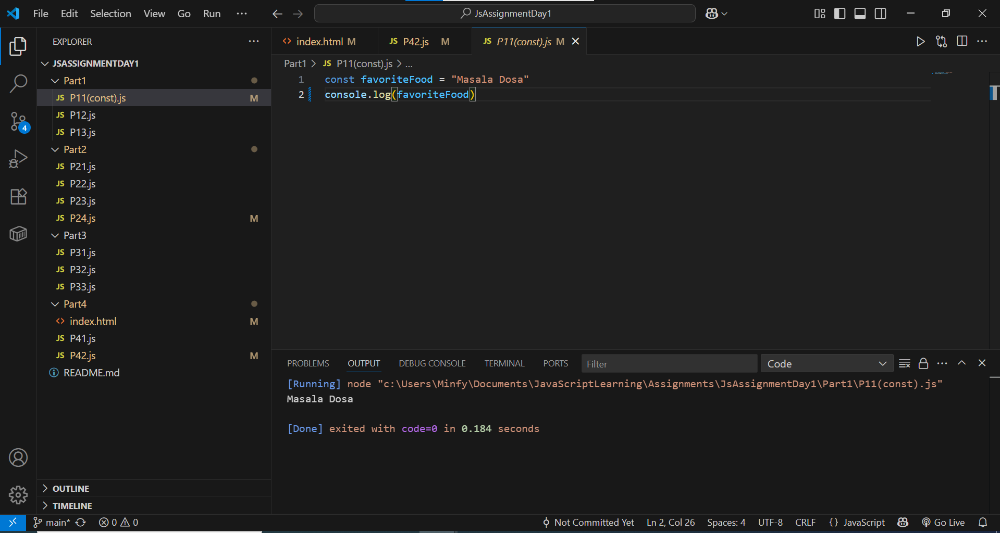

<h5> P1 - 2nd </h5>

[Easy] Create two variables, numA and numB, and assign them number values. Write an if/else statement to print which number is larger or if they are equal. 

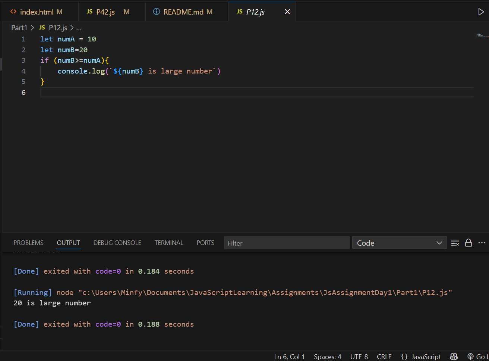

<h5> P1 - 3rd </h5>

[Medium] Write a for loop that prints the numbers from 1 to 20. For multiples of 3, print "Fizz" instead of the number. For multiples of 5, print "Buzz". For numbers which are multiples of both 3 and 5, print "FizzBuzz". 

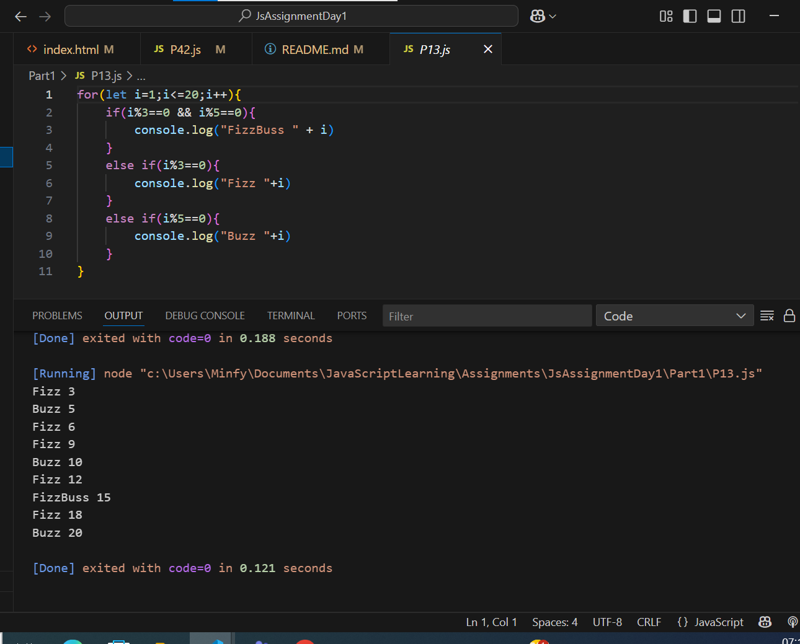

<h3> Part 2: Arrays Assignment Outpus</h3>

<h5> P2 -1st </h5>

[Easy] Create an array named colors with three of your favorite colors.

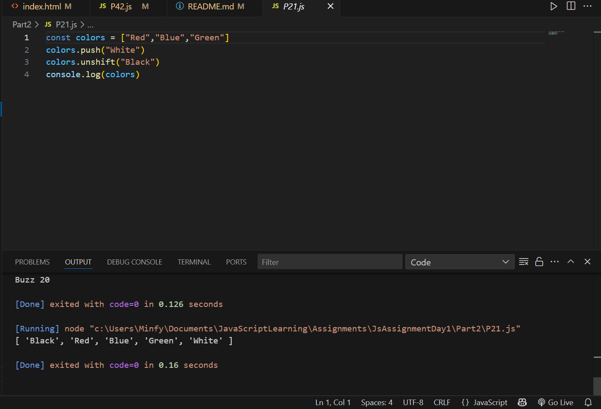

<h5> P2 - 2nd </h5>

 [Medium] Given the array let numbers = [10, 20, 30, 40, 50];, use the map method to create a new array where each number is increased by 5. 

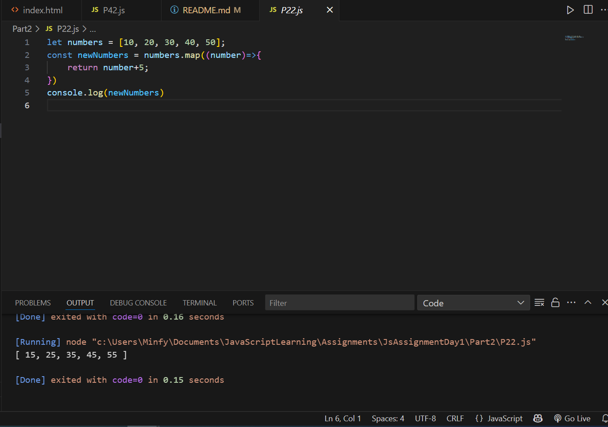

<h5> P2 - 3rd </h5>

 [Medium] Given the array let scores = [25, 80, 45, 95, 60, 75];, use the filter method to create a new array containing only the scores that are 70 or higher. 

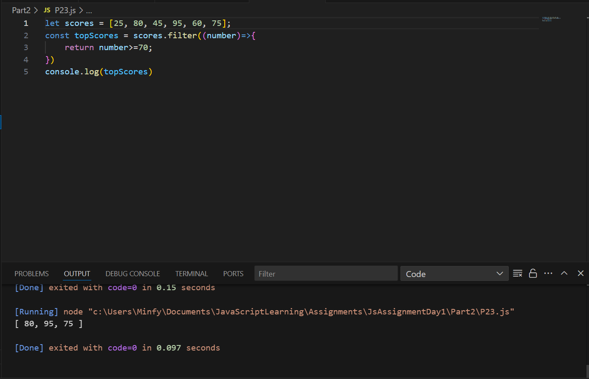

<h5> P2 - 4th </h5>

 [Hard] Use the reduce method on the scores array from the previous question to calculate the average score. (Hint: sum all scores and then divide by the number of scores). 

<b> Additional : Implemented without taking sum of scores </b> 

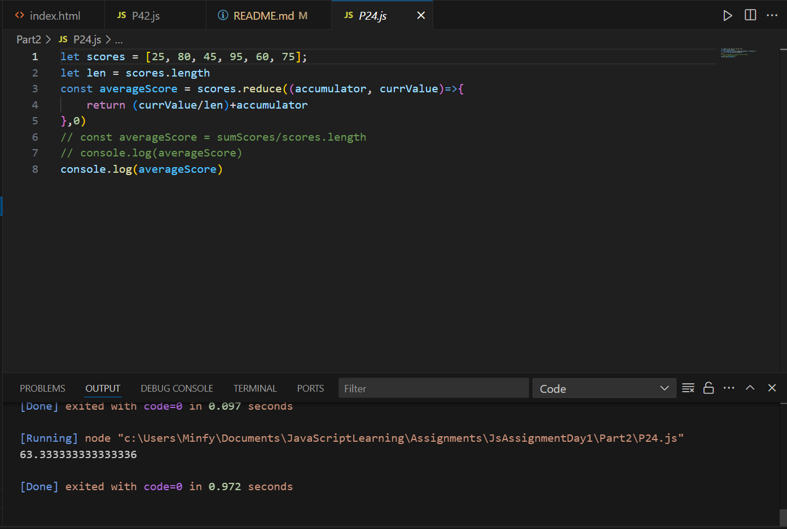
 
<h3> Part 3: Objects & Functions </h3>

<h5> P3 - 1st </h5>

[Easy] Create an object named movie with properties for title, director, and releaseYear. Print the title of the movie to the console.

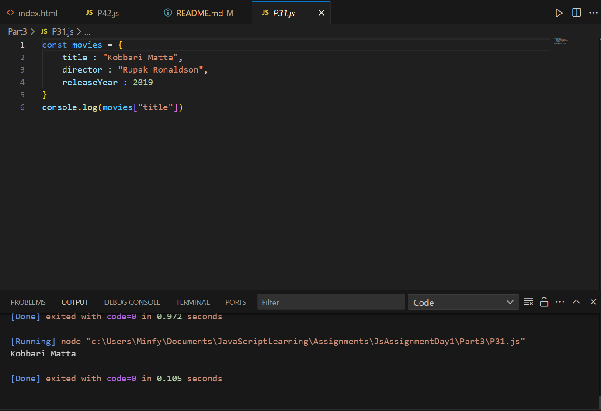

<h5> P3 - 2nd </h5>

 [Medium] Write a function called printUserDetails that takes a user object as an argument. The user object will have name, email, and age properties. The function should use object destructuring in its parameters to print a string like: "User's name is [NAME], and they are [AGE] years old." 

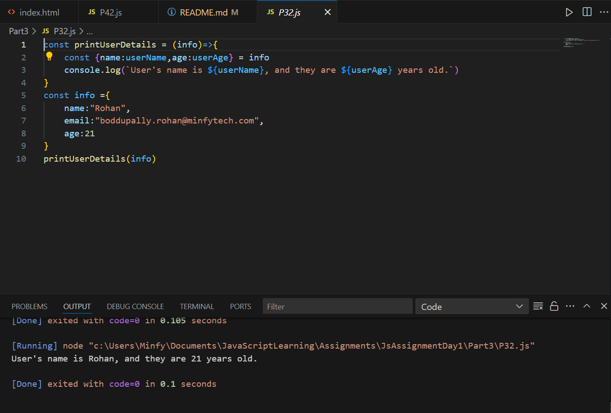

<h5> P3 - 3rd </h5>

[Medium] Create an array of user objects. Each object should have an id and a username. Use the find method to find the user with a specific id.

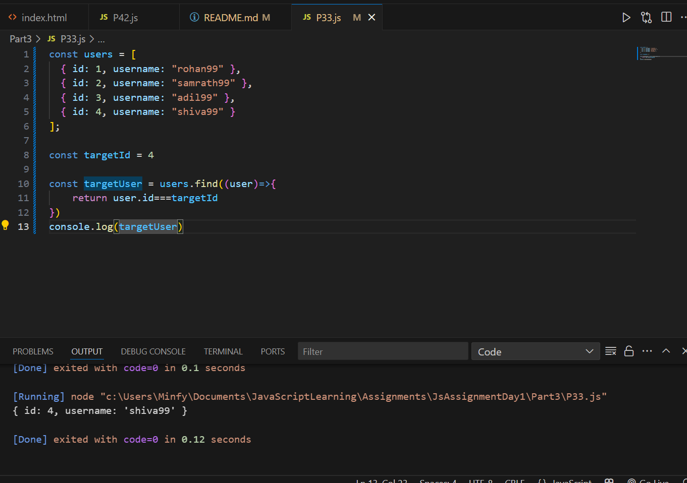

<h3> Part 4: Putting It All Together (Advanced) Outputs </h3>

<h5> P4 - 1st </h4>

[Hard] Write a function called getHighAchievers. This function should accept two arguments: an array of student objects and a passingScore number ................. 

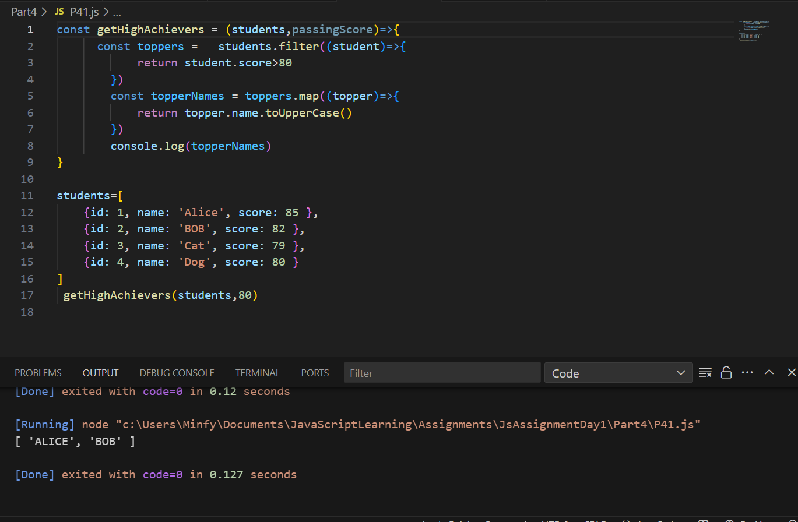

<h5> P4 - 2nd </h4>

 [Hard] Write a function called createGame ............ 

<b> Additional : 
    <ul>
        <li>Created HTML Page for game</li>
        <li>Background colour rendering according to number guessed</li>

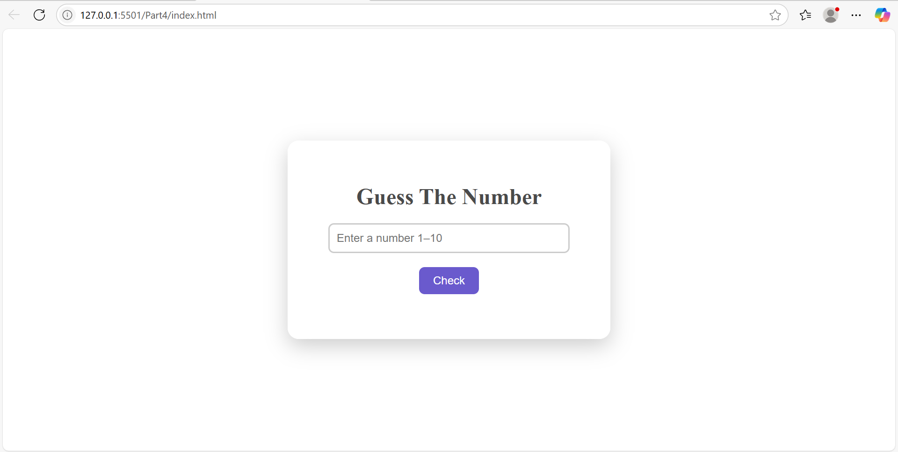

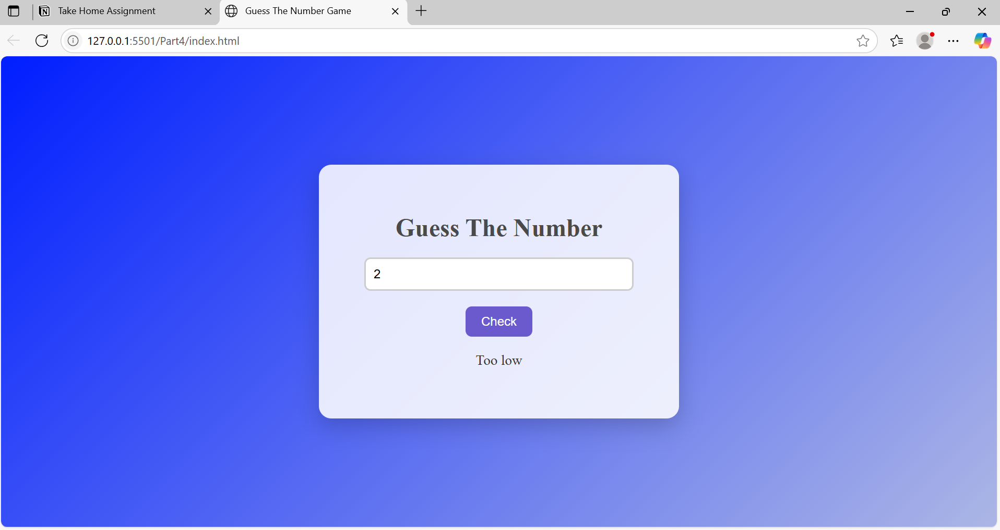

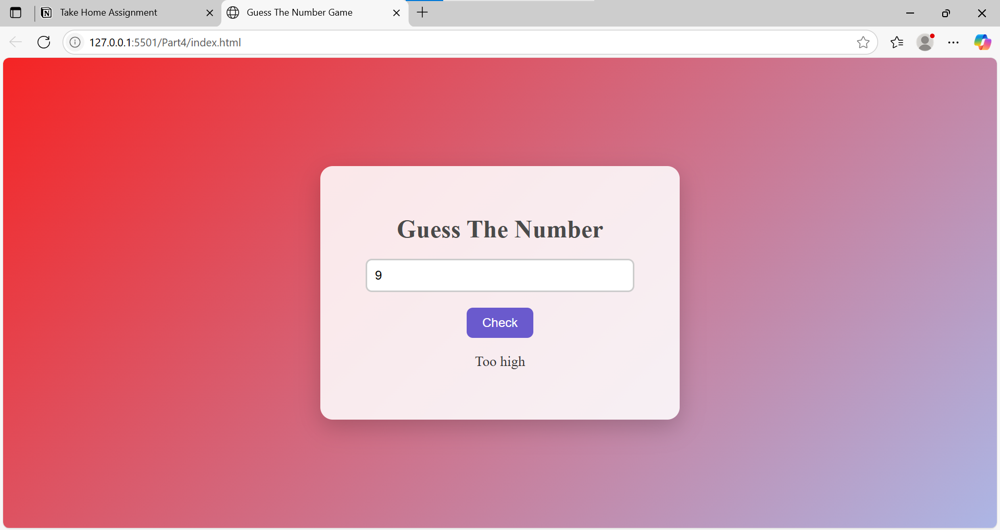

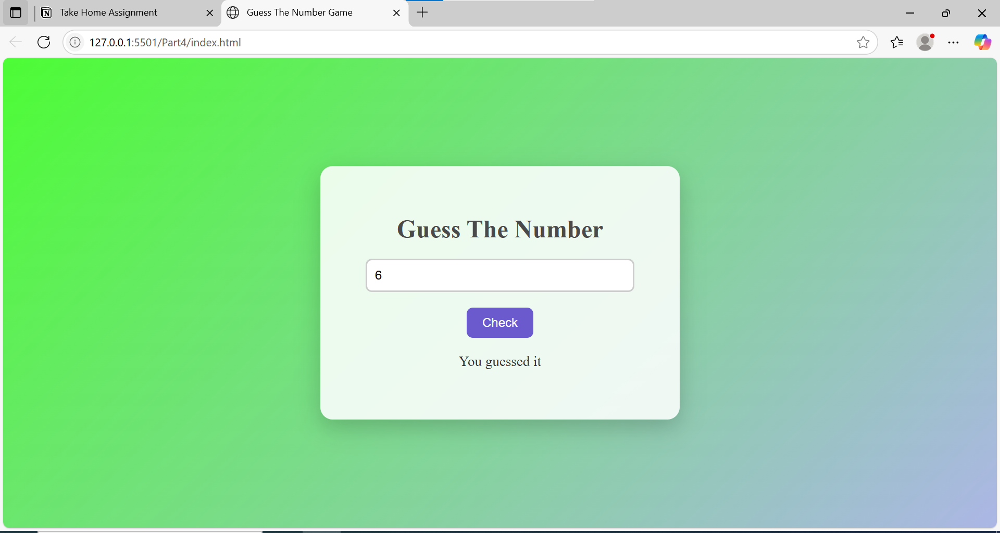

<b>-------------------------------- THE END --------------------------------</b>